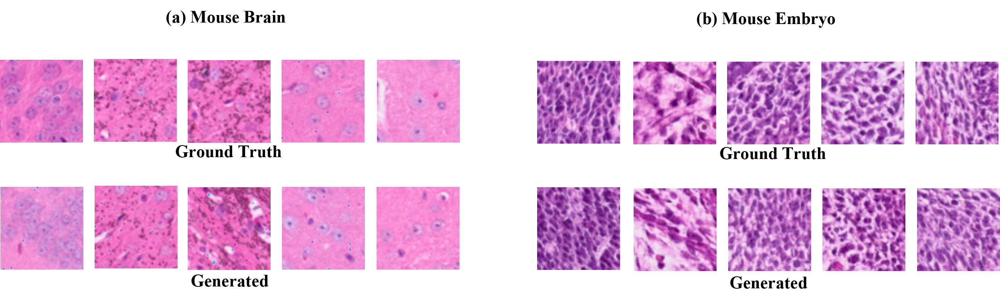
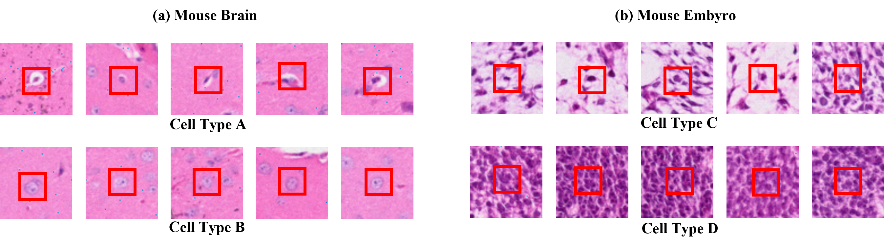

# SGE2Hist
This repository contains the code implementation for the paper titled "SGE2Hist: Generating Histology Images from Spatially Resolved Single-cell Gene Expression via Cross-modal Generative Network"
SGE2Hist is a model designed to generate histological images based on single-cell gene expression data. 

## Requirements

- Python 3.9+
- PyTorch 2.4.1+
- NumPy 2.0.2+


## Dataset

The dataset used in this project is the 10X GENOMICS Visium HD Spatial Gene Expression Library. you can get from “https://www.10xgenomics.com/datasets/visium-hd-cytassist-gene-expression-mouse-brain-fresh-frozen”  “https://www.10xgenomics.com/datasets/visium-hd-cytassist-gene-expression-libraries-of-mouse-embryo”.

And the paired spatial resolution single-cell RNA sequencing and H&E images we processed can be got from "https://pan.baidu.com/s/1gZsRJmA4ChITDF-1_bAAFQ?pwd=1oob" for Mouse Brain 
"https://pan.baidu.com/s/13ippRbnTgow9eVtZcTwZNg?pwd=r233" for Mouse Embyro.


## Usage


To use the SGE2Hist model, follow these steps:


1. **Pre-train the VAE**: First, you need to pre-train the VAE architecture to determine the initial Gaussian mixture distribution for clustering cell types. Use the following command:

    ```bash
    python pretrain.py 
    ```
2. **Load the Pre-trained VAE**: After pre-training, load the pre-trained VAE model for further training

    ```python
    from SGE2Hist import SGE2Hist
    from Dataset import DataSet

    # Initialize the SGE2Hist model with the pre-trained VAE
    model = SGE2Hist()
    model.load_state_dict(torch.load('Pretrained weight/pre_embyro.pt'))

    # Load the dataset
    dataset = DataSet(datadir='', transform=transform)

    # Train the complete model
    model.train(dataset)
    ```

**Pre-trained Model Weights**：You can download the pre-trained model weights from:"https://pan.baidu.com/s/1YxcC95lApwpzi27LoUBldw?pwd=wodz"

## Generating Histological Images

The SGE2Hist model offers two methods for generating histological images:

1. **Conditioned on RNA-seq**: This method generates images based on the single-cell RNA sequencing data. To use this method, run the following script:

    ```bash
    python GenerationfromGenes.py 
    ```

2. **Conditioned on Cell Type**: This method generates images based on specified cell types. To use this method, run the following script:

    ```bash
    python GenerationfromTypes.py 
    ```

## Results Showcase

To demonstrate the effectiveness of the two generation methods, we provide a comparison of the generated histological images. 

1. **Conditioned on RNA-seq**: The images generated using RNA-seq data highlight the cellular morphology and the surrounding environment informed by gene expression profiles.

    

2. **Conditioned on Cell Type**: The images generated based on specified cell types showcase how different cellular environments influence the resulting histological structures.

    


## License

This project is licensed under the MIT License. See the LICENSE file for details.
